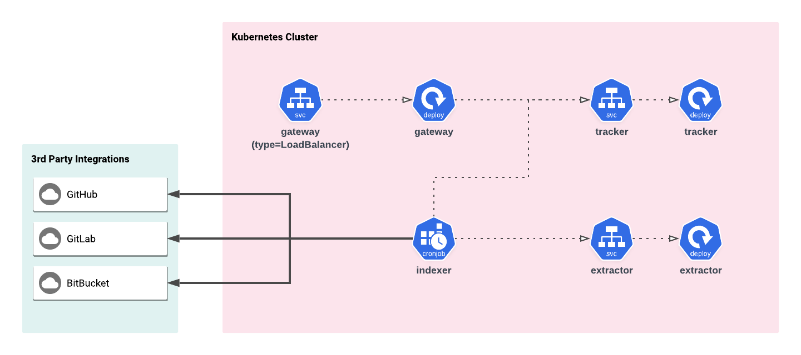

# deps.cloud

deps.cloud is a set of systems that parses, indexes, and stores dependencies between libraries.
The information is then served over gRPC or REST for easy consumption by automated processes.

* [Getting Started](getting_started/README.md)
* [Configuration](configuration/README.md)
  * [BitBucket](configuration/bitbucket.md)
  * [GitHub](configuration/github.md)
  * [GitLab](configuration/gitlab.md)
* [Contributing](contributing/README.md)
* User Guides
  * [Docker](getting_started/README.md)
  * [Kubernetes](user_guides/kubernetes.md)

## Open Core Architecture

This project is following an [Open Core model](https://en.wikipedia.org/wiki/Open-core_model).
Below, you will find a brief overview of the open core ecosystem (as seen in [Kubernetes](https://kubernetes.io)).

## Code of Conduct

deps.cloud is governed by the [Contributor Covenant v1.4.1](CODE_OF_CONDUCT.md).
